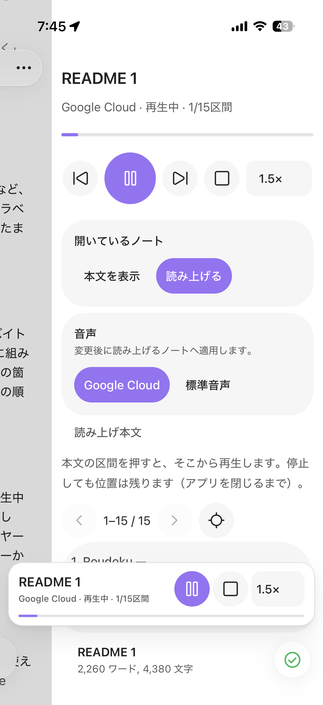
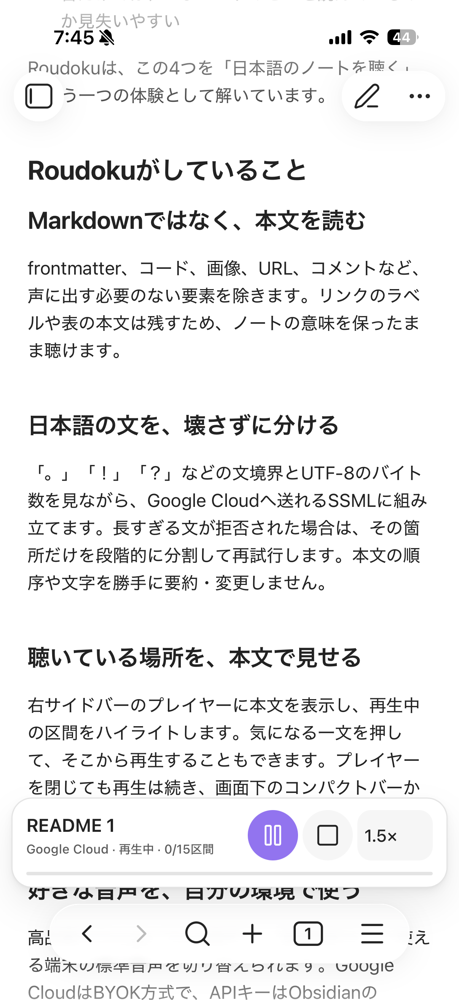
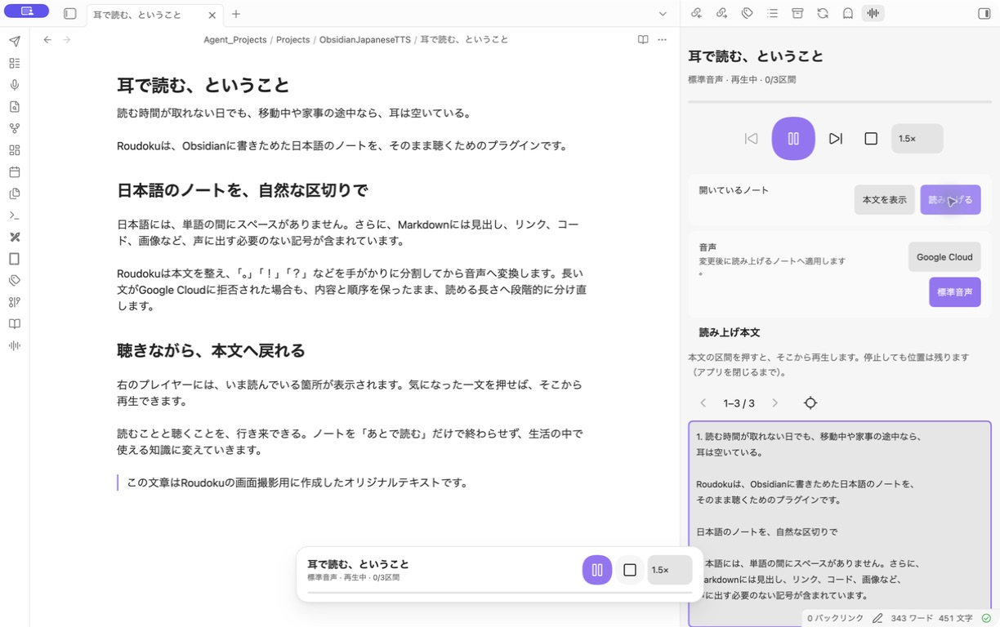

# Roudoku — Obsidianの日本語ノートを、耳で読む

**iPhoneのObsidianで、日本語ノートをそのまま聴く。**

保存した記事や読書メモを、iPhoneのObsidianで読み上げる。別のアプリへ本文をコピーする必要はありません。

Roudoku（朗読）は、日本語のMarkdownノートを聴くための無料プラグインです。iPhoneとMacで使えます。まずはAPIキー不要の標準音声で試し、Google Cloudの日本語音声へ切り替えることもできます。Google CloudのAPI利用料は別途、利用者負担です。

ノートを開いたまま画面下のミニバーで操作でき、右サイドバーでは読み上げ本文と現在位置を確認できます。

[インストールして試す](#インストール) · [iPhoneでの使い方](#iphoneで最初のノートを聴く)

> 現在はObsidianを開いた状態での利用を想定しています。画面ロック中・他のアプリに切り替えたあとの継続再生は保証していません。

<p align="center">
  
  
</p>

<p align="center"><sub>iPhoneでのプレイヤー表示と、ノートを読みながら操作できるミニバー</sub></p>

[Obsidianに追加する](https://community.obsidian.md/plugins/roudoku) · [最新版をダウンロードする](https://github.com/analosmith/obsidian-roudoku/releases/latest)

## なぜ、日本語ノート向けに作ったのか

Obsidianに保存した記事やメモを、画面を読み続けずに振り返りたい。そのためには、日本語の音声を選ぶだけでなく、ノートを読み上げに適した形に整え、聴きたい場所へ戻れることも必要です。

- **ノートの記号を読み上げない。** URLやコードなどを除き、見出しやリンクの表示テキストを読み上げます。
- **日本語の長い文章を扱う。** 句点や改行で区切り、日本語の文字数だけでは判断できない送信データ量も考慮します。
- **長文エラーに備える。** Google Cloudが文の長さを理由に拒否した場合は、その箇所を短く分けて再試行します。
- **本文と音声を行き来する。** 再生中の区間を確認し、気になった箇所から聴き直せます。

Roudokuは、この読み上げ前の処理と再生操作を、Obsidianの中でまとめて行います。

## Roudokuがしていること

### Markdownではなく、本文を読む

ノート冒頭のプロパティ（frontmatter）、コード、画像、URL、コメントを読み上げ対象から除きます。見出しの文字、リンクの表示テキスト、表の文字は残します。元のノートは変更しません。

### 日本語の文を、壊さずに分ける

「。」「！」「？」や改行を手がかりに区切り、Google Cloudへ送るデータ量に収まるよう調整します。長すぎる文が拒否された場合は、その箇所をさらに分割して再試行します。前処理後の本文を要約せず、順序を保って読み上げます。再試行には上限があり、すべての長文の再生を保証するものではありません。

### 聴いている場所を、本文で見せる

右サイドバーのプレイヤーに本文を表示し、再生中の区間をハイライトします。区間をタップすると、その先頭から再生できます。1区間に複数の文が含まれることもあります。Obsidian内でプレイヤーを閉じても再生は続き、画面下のミニバーから操作できます。



### 好きな音声を、自分の環境で使う

まず動作を試すなら、APIキー不要の標準音声がおすすめです。音声の選択肢を増やしたい場合は、自分のGoogle CloudプロジェクトとAPIキーを登録して使えます。設定とAPI利用料が必要になるため、標準音声で操作を確認してから切り替えられます。Roudoku独自のサーバーや利用状況の収集はありません。

## 主な機能

- 現在のMarkdownノートを日本語で読み上げ
- Google Cloud Text-to-Speech / 端末標準音声の切り替え
- 再生、一時停止、停止、前後の区間への移動
- 0.75× / 1× / 1.25× / 1.5×の再生速度
- 次の1区間を先読みし、区間の切り替わりを短縮
- 本文表示、再生位置のハイライト、タップした区間からの再生
- 右サイドバープレイヤーと画面下のコンパクトバー
- プレイヤーを閉じても継続する再生セッション
- 長い文が拒否されたときの自動分割・再試行

## インストール

Obsidian 1.11.5以降が必要です。

### コミュニティプラグインから

1. Obsidianの「設定」→「コミュニティプラグイン」を開きます。
2. 「閲覧」で `Roudoku` を検索します。
3. インストールして、有効化します。

[ObsidianでRoudokuを開く](https://community.obsidian.md/plugins/roudoku)

<details>
<summary>手動インストール（通常は上の方法で導入できます）</summary>

1. [最新のGitHub Release](https://github.com/analosmith/obsidian-roudoku/releases/latest)から `main.js`、`manifest.json`、`styles.css` をダウンロードします。
2. `<Vault>/.obsidian/plugins/roudoku/` を作り、3ファイルを置きます。
3. Obsidianを再読み込みし、「設定」→「コミュニティプラグイン」でRoudokuを有効化します。

</details>

## iPhoneで最初のノートを聴く

インストール後は、APIキーなしの標準音声で試せます。

1. 読み上げたいノートを開きます。
2. Obsidianのコマンドパレットで `Roudoku` を検索し、「プレイヤーを開く」を実行します。
3. プレイヤーの「音声」で「標準音声」を選びます。
4. 「開いているノート」の「読み上げる」をタップします。

再生が始まったらサイドバーを閉じて、ノートへ戻れます。画面下のミニバーで一時停止・再開でき、ノート名をタップするとプレイヤーへ戻れます。

途中から聴きたい場合は、「本文を表示」をタップしてから、読み上げたい区間をタップしてください。「本文を表示」だけでは音声合成を行いません。

Macでも同じコマンドで操作できます。左リボンの波形アイコンでもプレイヤーを開けます。

端末やOSによって、利用できる日本語音声とオフライン動作は異なります。

## Google Cloudの音声を使う

Google Cloudを使う場合は、利用者自身のプロジェクトとAPIキーが必要です。API利用料はそのプロジェクトに請求されます。

1. Google CloudプロジェクトでCloud Text-to-Speech APIと請求先を有効にします。
2. 適切なAPI制限を設定したAPIキーを作成します。
3. Obsidianの「設定」→「Roudoku」で、APIキーを保存するSecretStorage項目を作成または選択します。
4. 接続確認で、日本語音声の一覧を取得します。
5. プレイヤーで「Google Cloud」を選び、ノートを再生します。

SecretStorageの認証情報は端末ごとに登録してください。接続確認は音声一覧の取得までで、音声合成の成功や料金を保証するものではありません。

## プライバシーと料金

- Google Cloudで再生するときは、前処理したノート本文とAPIキーを `texttospeech.googleapis.com` へ送信します。Googleの規約と利用者自身のプロジェクト料金が適用されます。
- Roudokuが運営するサーバー、テレメトリー、アクセス解析はありません。
- プラグイン設定に保存するのはSecretStorageの項目名です。APIキーを平文で保存する機能はありません。
- ノート本文、APIキー、APIの生エラー本文をログへ記録しません。
- 停止後の遅い応答や不要になった先読み音声は破棄します。ただし、送信済みリクエストの課金を取り消すことはできません。
- 前後移動や再生位置の変更で新しい音声合成が発生し、追加料金がかかる場合があります。永続的な音声キャッシュはありません。

## 現在の制限

- 進捗は経過秒数ではなく、読み終えた区間数で表示します。
- 停止位置は区間単位です。再開すると、その区間の先頭から読み直します。
- 停止位置はアプリやプラグインを閉じるまでの一時的な記憶です。別のノートを読み込んだ場合も置き換わります。
- 画面ロック中・バックグラウンドでの継続再生は保証していません。
- AndroidとiPadは未検証です。開発時はObsidian 1.13.7のMacとiPhoneで確認しています。
- MP3書き出し、フォルダ単位の連続再生、秒単位のシーク、読み方辞書、Google Cloud以外のクラウド音声には未対応です。
- 埋め込みノートの内容は展開しません。

不具合や要望は[GitHub Issues](https://github.com/analosmith/obsidian-roudoku/issues)へお寄せください。再現するノート本文やAPIキーなどの機密情報は貼らないでください。

<details>
<summary>English summary</summary>

Roudoku is a free Obsidian plugin for listening to Japanese Markdown notes. It cleans Markdown-only elements, splits Japanese text into speech-safe segments, recovers from Google Cloud length errors, and keeps the current passage visible in a sidebar transcript.

It supports Google Cloud Text-to-Speech and device speech. Google Cloud is BYOK: usage is billed to your own project, and credentials are stored with Obsidian SecretStorage. There is no plugin-operated server, telemetry, or analytics.

Requires Obsidian 1.11.5 or later. See the Japanese sections above for setup, privacy, costs, and current limitations.

</details>

## 開発

Node.js 24以降を使用します。

```sh
npm ci
npm run check
npm run format:check
npm run package
```

`npm run package` はソースを検証し、`dist/roudoku/` とZIPアーカイブへ配布物を生成します。GitHub Releaseのタグは `manifest.json` のバージョンと一致させ、`main.js`、`manifest.json`、`styles.css` の3ファイルを個別に添付します。

## ライセンスとクレジット

MIT License。

アーキテクチャの検討では[Obsidian Voice](https://github.com/chrisurf/obsidian-voice)を参考にしました。テキスト処理、再生、設定、音声プロバイダーの実装は独自に行っています。ビルドとLintの構成は、Obsidian公式のサンプルプラグインを参考にしました。
